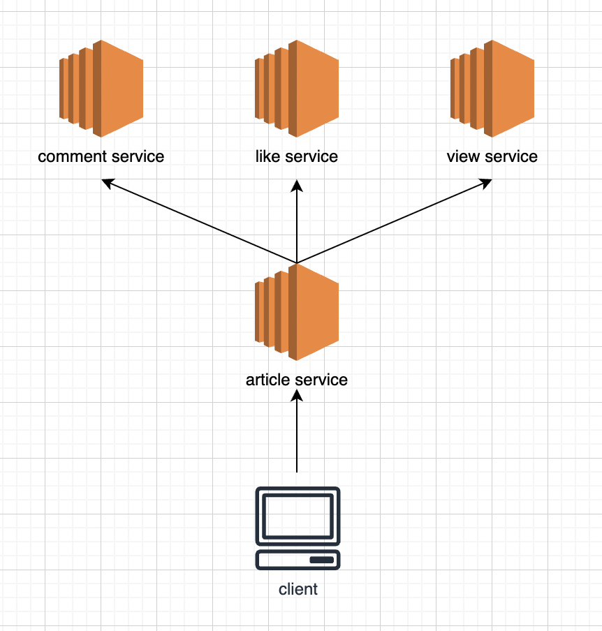
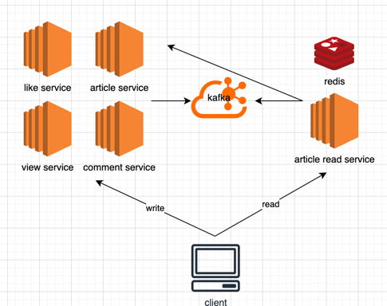

## 게시글 조회 최적화
### 문제 상황
- 읽기 트래픽이 쓰기 트래픽보다 압도적으로 많아서 읽기 트래픽을 위해 리소스를 증설하면 쓰기 리소스도 같이 증설되야함
- 게시글 조회를 하면 댓글, 조회수, 좋아요 수 등을 같이 조회해야 하는데 마이크로 서비스가 분리되어 있음
- comment, like, view 서비스는 각각 article_id를 가지고 있기 때문에 유효성 검사를 위해 조회를 해야하는 상황이므로 순환 의존성이 생김 

### 해결 방안
- 게시글 조회를 위한 서비스를 분리하고, 각 서비스에 데이터를 요청해 조합 / 응답한다. (CQRS)
- 실시간으로 각 서비스에 데이터를 계속 질의하면 장애가 전파될 수 있는 위험이 있으므로, polling, Message Broker 등으로 해결할 수 있다.
- Redis를 채택해 빠른 응답속도를 보장하고, 대부분 최근 게시물을 조회하는 데이터의 특성상 최근 24시간 이내 데이터만 저장해 메모리 부족현상을 방지한다. 또한, 데이터가 없을 경우나 Redis에 장애가 생긴 경우 각 서비스로 질의해 가용성을 높인다.

