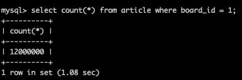

## 페이지 
### 쿼리 인덱스 추가하기

~~~mysql
select * from article where board_id = 1 order by created_at desc limit 30 offset 90
~~~
페이징 조회를 하는 단순한 쿼리라도 인덱스를 타지 않으면 애플리케이션에서 사용할 수 없을 만큼 느려지게 된다.

이 문제를 해결하기 위해 인덱스를 추가 해준다.

~~~mysql
create index idx_board_id_article_id on article(board_id asc, article_id desc);
~~~

### 추가 문제: Offset이 커질 때
~~~mysql
select * from article where board_id = 1 order by article_id desc limit 30 offset 1499970;
~~~

하지만, offset이 커지게 되면 다시 느려지게 된다. 
이는, secondary index가 현재 article_id, board_id 만 포함하기 때문에 데이터를 가져오기 위해 다시 clustered index를 조회해야 하기 때문이다.

이를 해결하기 위해 offset 구간까지는 secondary index만 사용하고, 필요한 레코드만 clustered index를 조회하는 방식으로 쿼리를 수정할 수 있다. 
~~~mysql
select * from ( select article_id from article where board_id = 1 order by article_id desc limit 30 offset 1499970 ) t left join article on t.article_id = article.article_id;
~~~

### 추가 고려사항
offset이 너무 커지면 이 방법도 한계가 있다. 
연 단위로 테이블을 분리하거나 정책적으로 최신 글 위주로 페이징 하도록 유도하는 등으로 해결할 수 있다.

## 이동 가능한 페이지 번호 최적화
페이징을 하려면 전체 게시글 수를 조회해야한다. 
하지만, 전체 게시물 수가 많아질수록 이 쿼리는 심각하게 느려지게 된다.

### 해결 방법
모든 게시글의 개수를 알 필요는 없다. 
대신, 현재 이용중인 페이지 기준으로 이동 가능한 페이지 수 정도만 계산해도 충분하다. 
공식으로 보면 다음과 같다.
>(((n - 1) / k) + 1) * m * k + 1 
- 현재 페이지(n)
- 페이지 당 게시글 개수(m)
- 이동 가능한 페이지 개수(k)

이 방법은 필요한 범위만 빠르게 계산해 성능을 개선할 수 있다.